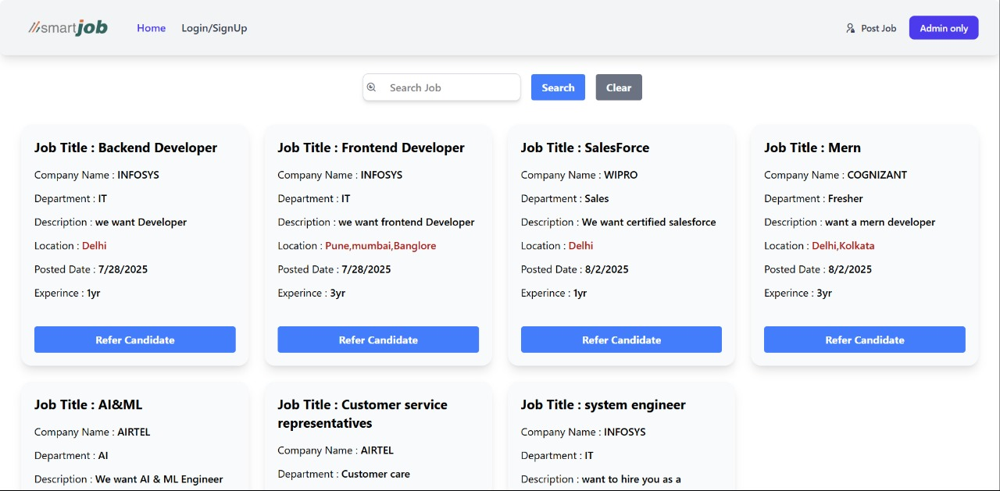
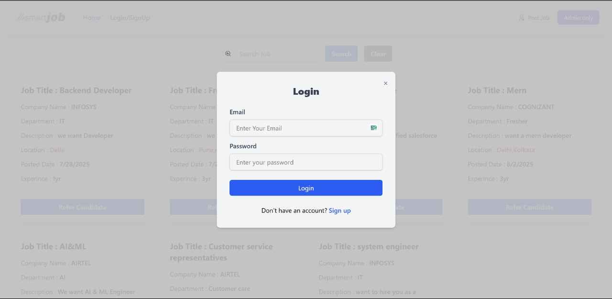
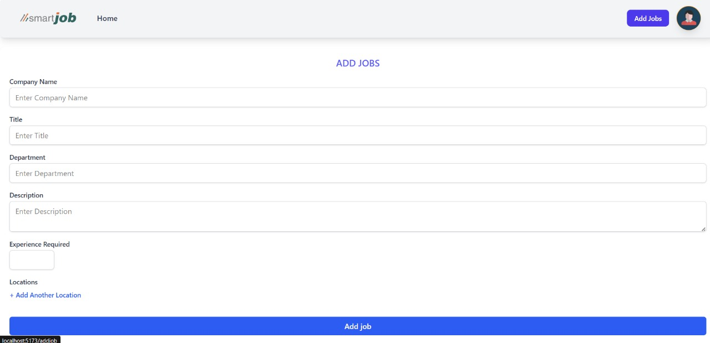
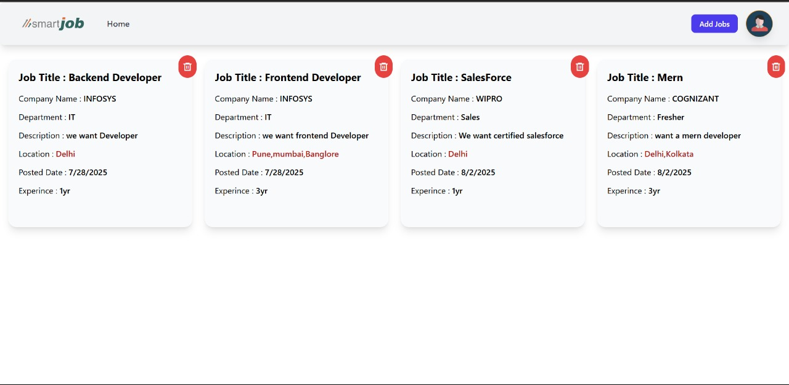
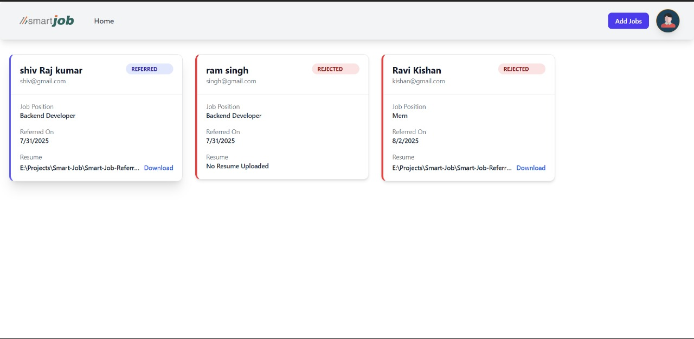
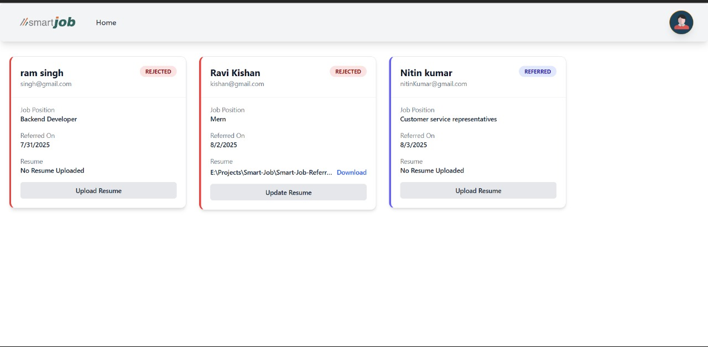

# 💼 Smart Job Referral Portal

A full-stack web application that simplifies job posting, candidate referrals, and resume management. Built using **Spring Boot** and **Vite + React**, the platform allows HR/admins to post jobs, and employees to refer candidates with resume uploads and status tracking.

---

## 🚀 Features

- 🔒 Login / Signup (JWT Auth)
- 👤 Role-Based Access: Admin & Referrer
- 📝 Add Job Postings (Admin only)
- 🔍 Search & Filter Jobs
- 📤 Refer Candidates with Resume Upload
- 📥 Update / Download Resumes
- 📊 Track Referral Status (Referred / Rejected)

---

## 🛠 Tech Stack

| Tech            | Description              |
|----------------|--------------------------|
| **Frontend**    | Vite + React, Tailwind CSS |
| **Backend**     | Spring Boot (Java), Spring Security, Spring Data JPA |
| **Database**    | MySQL                    |
| **Authentication** | JWT-based Auth |
| **Tooling**     | Maven, Postman, GitHub   |

---

## 📸 Screenshots

### 🔹 Home Page

### 🔹 Login Page

### 🔹 Admin - Add Job

### 🔹 Admin - Post Job List

### 🔹 Admin - Referral Page

### 🔹 Refer Candidate Form

### 🔹 Referrer Page

---

## 📂 Project Structure

 <pre>  Smart-Job-Referral/
├── Smart-Job-Referral-Portal (Backend)
│ ├── src/main/java/com/smartjob/...
│ └── application.properties
├── SmartJob (Frontend)
│ ├── src/
│ └── vite.config.js
├── assets/
│ └── [Screenshots]
└── README.md  </pre>

## Frontend (React + Vite)
<pre>cd SmartJob
npm install
npm run dev<pre>

